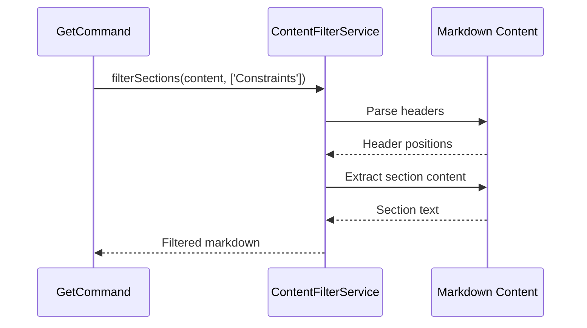
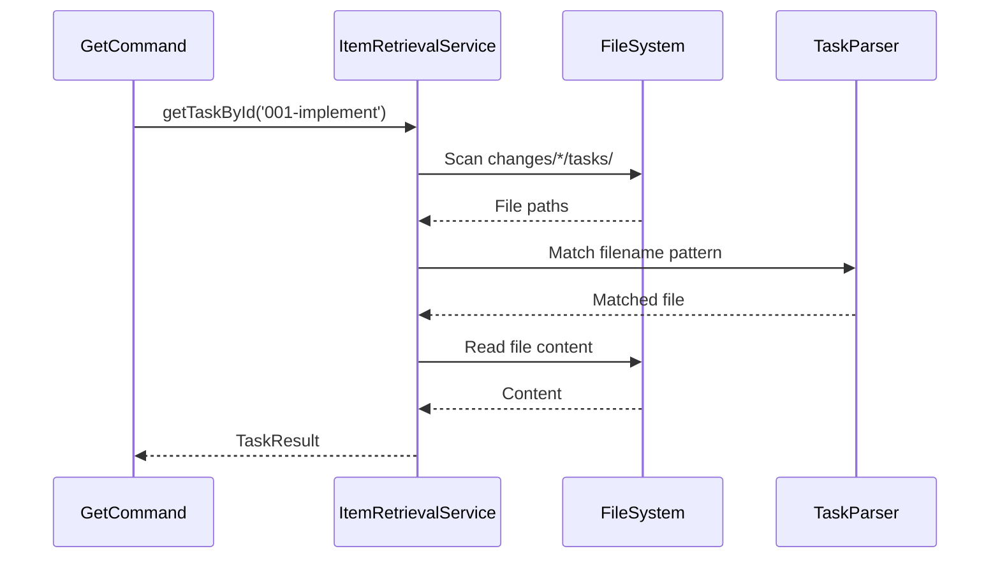

# PLX-15 Technical Refinement Spec

## Issue Reference
- **Linear:** [PLX-15](https://linear.app/de-app-specialist/issue/PLX-15/user-can-retrieve-specific-items-and-filter-task-content-with-cli)
- **GitHub:** [#23](https://github.com/appboypov/OpenSplx/issues/23)

---

## 1. Packages

No new packages required. Implementation uses existing dependencies:
- `chalk` (terminal styling)
- `ora` (spinners)
- `commander` (CLI framework - already configured)

---

## 2. ViewModels

N/A - This is a CLI tool without a UI layer. All state management is handled by services and command handlers.

---

## 3. Services

### 3.1 ContentFilterService (NEW)

**Location:** `src/services/content-filter.ts`

**Purpose:** Extract specific markdown sections from task and change content.

**Public Methods:**

```typescript
interface ContentFilterService {
  /**
   * Extracts specified sections from markdown content.
   * @param content - Full markdown file content
   * @param sections - Array of section names to extract (e.g., ['Constraints', 'Acceptance Criteria'])
   * @returns Filtered content containing only the specified sections with their headers
   */
  filterSections(content: string, sections: string[]): string;

  /**
   * Aggregates specified sections from multiple task files.
   * @param taskContents - Array of task file contents
   * @param sections - Array of section names to extract
   * @returns Combined content with task identifiers
   */
  filterMultipleTasks(taskContents: TaskContent[], sections: string[]): string;
}

interface TaskContent {
  filename: string;
  content: string;
}
```

**Implementation Notes:**
- Uses regex to match `## SectionName` headers (case-insensitive)
- Extracts content until next `##` header or end of file
- Preserves original formatting including checkboxes
- Returns empty string if no matching sections found

**Flow Diagram:**


---

### 3.2 ItemRetrievalService (NEW)

**Location:** `src/services/item-retrieval.ts`

**Purpose:** Retrieve tasks, changes, and specs by ID.

**Public Methods:**

```typescript
interface ItemRetrievalService {
  /**
   * Retrieves a specific task by ID (filename without extension).
   * @param taskId - Task filename without .md extension (e.g., '001-implement-core')
   * @param changeId - Optional change ID to scope the search
   * @returns Task content and metadata, or null if not found
   */
  getTaskById(taskId: string, changeId?: string): Promise<TaskResult | null>;

  /**
   * Retrieves a specific change proposal.
   * @param changeId - Change directory name
   * @returns Change content (proposal.md, design.md) and task list
   */
  getChangeById(changeId: string): Promise<ChangeResult | null>;

  /**
   * Retrieves a specific spec.
   * @param specId - Spec directory name
   * @returns Spec content (spec.md, design.md if exists)
   */
  getSpecById(specId: string): Promise<SpecResult | null>;

  /**
   * Lists all tasks for a specific change.
   * @param changeId - Change ID (specs don't have task directories)
   * @returns Array of task summaries
   */
  getTasksForChange(changeId: string): Promise<TaskSummary[]>;

  /**
   * Lists all open tasks across all changes.
   * @returns Array of task summaries with change context
   */
  getAllOpenTasks(): Promise<TaskSummary[]>;
}

interface TaskResult {
  id: string;
  filename: string;
  filepath: string;
  content: string;
  status: TaskStatus;
  changeId: string;
  sequence: number;
}

interface ChangeResult {
  id: string;
  proposal: string;
  design?: string;
  tasks: TaskSummary[];
}

interface SpecResult {
  id: string;
  spec: string;
  design?: string;
}

interface TaskSummary {
  id: string;
  filename: string;
  status: TaskStatus;
  changeId: string;
  sequence: number;
  name: string;
}
```

**Flow Diagram:**


---

## 4. APIs

N/A - This feature does not interact with external APIs. All data is file-system based.

---

## 5. DTOs

### 5.1 GetTaskOptions

```yaml
GetTaskOptions:
  id:
    type: string
    required: false
    description: Task ID (filename without extension)
  constraints:
    type: boolean
    required: false
    default: false
    description: Filter to show only Constraints section
  acceptanceCriteria:
    type: boolean
    required: false
    default: false
    description: Filter to show only Acceptance Criteria section
  json:
    type: boolean
    required: false
    default: false
    description: Output as JSON
  didCompletePrevious:
    type: boolean
    required: false
    default: false
    description: Mark previous task as complete
```

### 5.2 GetChangeOptions

```yaml
GetChangeOptions:
  id:
    type: string
    required: true
    description: Change ID (directory name)
  constraints:
    type: boolean
    required: false
    default: false
    description: Filter to show only Constraints sections from all tasks
  acceptanceCriteria:
    type: boolean
    required: false
    default: false
    description: Filter to show only Acceptance Criteria sections from all tasks
  json:
    type: boolean
    required: false
    default: false
    description: Output as JSON
```

### 5.3 GetSpecOptions

```yaml
GetSpecOptions:
  id:
    type: string
    required: true
    description: Spec ID (directory name)
  json:
    type: boolean
    required: false
    default: false
    description: Output as JSON
# Note: No filter flags (--constraints, --acceptance-criteria) for specs.
# Specs use Requirements/Scenarios structure, not task sections.
```

### 5.4 GetTasksOptions

```yaml
GetTasksOptions:
  id:
    type: string
    required: false
    description: Change ID to filter tasks (specs don't have tasks)
  json:
    type: boolean
    required: false
    default: false
    description: Output as JSON
```

---

## 6. Enums

### 6.1 ContentSection

```typescript
enum ContentSection {
  CONSTRAINTS = 'Constraints',
  ACCEPTANCE_CRITERIA = 'Acceptance Criteria',
  IMPLEMENTATION_CHECKLIST = 'Implementation Checklist',
  END_GOAL = 'End Goal',
  CURRENTLY = 'Currently',
  SHOULD = 'Should',
  NOTES = 'Notes'
}
```

---

## 7. Constants

### 7.1 Command Registry Additions

```typescript
// In src/core/completions/command-registry.ts
const GET_COMMAND: CommandDefinition = {
  name: 'get',
  description: 'Get tasks, changes, or specs',
  flags: [],
  subcommands: [
    {
      name: 'task',
      description: 'Get the next prioritized task or a specific task by ID',
      flags: [
        { name: 'id', description: 'Task ID (filename without extension)', takesValue: true },
        { name: 'constraints', description: 'Show only Constraints section' },
        { name: 'acceptance-criteria', description: 'Show only Acceptance Criteria section' },
        { name: 'json', description: 'Output as JSON' },
        { name: 'did-complete-previous', description: 'Mark previous task as complete' }
      ]
    },
    {
      name: 'change',
      description: 'Get a specific change proposal',
      acceptsPositional: true,
      positionalType: 'change-id',
      flags: [
        { name: 'id', description: 'Change ID', takesValue: true },
        { name: 'constraints', description: 'Show only Constraints sections from all tasks' },
        { name: 'acceptance-criteria', description: 'Show only Acceptance Criteria sections' },
        { name: 'json', description: 'Output as JSON' }
      ]
    },
    {
      name: 'spec',
      description: 'Get a specific specification',
      acceptsPositional: true,
      positionalType: 'spec-id',
      flags: [
        { name: 'id', description: 'Spec ID', takesValue: true },
        { name: 'json', description: 'Output as JSON' }
      ]
    },
    {
      name: 'tasks',
      description: 'List all open tasks or tasks for a specific change/spec',
      flags: [
        { name: 'id', description: 'Parent change or spec ID', takesValue: true },
        { name: 'json', description: 'Output as JSON' }
      ]
    }
  ]
};
```

---

## 8. ARBs

N/A - CLI tool does not use localization files.

---

## 9. Utils

### 9.1 Section Extraction Utility

**Location:** `src/utils/markdown-sections.ts`

```typescript
/**
 * Extracts a specific section from markdown content.
 * @param content - Full markdown content
 * @param sectionName - Name of section to extract (e.g., 'Constraints')
 * @returns Section content including header, or null if not found
 */
export function extractSection(content: string, sectionName: string): string | null;

/**
 * Lists all section names in markdown content.
 * @param content - Full markdown content
 * @returns Array of section names (without ## prefix)
 */
export function listSections(content: string): string[];
```

---

## 10. TDD Gherkin Unit Tests

### 10.1 ContentFilterService Tests

```gherkin
Feature: Content filtering for tasks and changes

  Scenario: Filter single section from task content
    Given a task file with Constraints, Acceptance Criteria, and Implementation Checklist sections
    When filterSections is called with ['Constraints']
    Then only the Constraints section is returned with its header and content

  Scenario: Filter multiple sections from task content
    Given a task file with Constraints, Acceptance Criteria, and Implementation Checklist sections
    When filterSections is called with ['Constraints', 'Acceptance Criteria']
    Then both sections are returned in original order

  Scenario: Filter non-existent section
    Given a task file without a Notes section
    When filterSections is called with ['Notes']
    Then an empty string is returned

  Scenario: Case-insensitive section matching
    Given a task file with '## CONSTRAINTS' header
    When filterSections is called with ['constraints']
    Then the section is matched and returned

  Scenario: Aggregate sections from multiple tasks
    Given three task files each with Constraints sections
    When filterMultipleTasks is called with ['Constraints']
    Then all three Constraints sections are returned with task identifiers
```

### 10.2 ItemRetrievalService Tests

```gherkin
Feature: Item retrieval by ID

  Scenario: Retrieve task by ID without change scope
    Given tasks exist in multiple changes: change-a/tasks/001-foo.md, change-b/tasks/001-bar.md
    When getTaskById is called with '001-foo'
    Then the task from change-a is returned

  Scenario: Retrieve task by ID with change scope
    Given change-a has task 001-impl.md
    When getTaskById is called with '001-impl' and changeId 'change-a'
    Then the task content and metadata are returned

  Scenario: Task ID not found
    Given no task with ID '999-nonexistent' exists
    When getTaskById is called with '999-nonexistent'
    Then null is returned

  Scenario: Retrieve change by ID
    Given change 'add-feature' exists with proposal.md and design.md
    When getChangeById is called with 'add-feature'
    Then proposal, design, and task list are returned

  Scenario: Retrieve spec by ID
    Given spec 'user-auth' exists with spec.md
    When getSpecById is called with 'user-auth'
    Then spec content is returned

  Scenario: List tasks for change
    Given change 'add-feature' has 3 tasks
    When getTasksForParent is called with 'add-feature' and 'change'
    Then 3 task summaries are returned

  Scenario: List all open tasks
    Given 5 open tasks across 2 changes
    When getAllOpenTasks is called
    Then 5 task summaries are returned with change context
```

### 10.3 GetCommand Tests

```gherkin
Feature: Get command with new flags

  Scenario: Get specific task by ID
    Given task '001-implement' exists in change 'add-feature'
    When 'plx get task --id 001-implement' is executed
    Then the task content is displayed

  Scenario: Get task with constraints filter
    Given task has Constraints and Implementation Checklist sections
    When 'plx get task --id 001-impl --constraints' is executed
    Then only the Constraints section is displayed

  Scenario: Get task with combined filters
    Given task has all standard sections
    When 'plx get task --id 001-impl --constraints --acceptance-criteria' is executed
    Then both Constraints and Acceptance Criteria sections are displayed

  Scenario: Get change by ID
    Given change 'add-feature' exists
    When 'plx get change --id add-feature' is executed
    Then proposal.md and task list are displayed

  Scenario: Get change with content filters
    Given change 'add-feature' has 2 tasks with Constraints sections
    When 'plx get change --id add-feature --constraints' is executed
    Then all Constraints sections from all tasks are displayed

  Scenario: Get spec by ID
    Given spec 'user-auth' exists
    When 'plx get spec --id user-auth' is executed
    Then spec.md content is displayed

  Scenario: List all open tasks
    Given 5 open tasks exist
    When 'plx get tasks' is executed
    Then a list of 5 tasks with status and change context is displayed

  Scenario: List tasks for specific change
    Given change 'add-feature' has 3 tasks
    When 'plx get tasks --id add-feature' is executed
    Then 3 tasks are listed

  Scenario: ID not found error
    Given no item with ID 'nonexistent' exists
    When 'plx get task --id nonexistent' is executed
    Then error message "Task 'nonexistent' not found" is displayed
```

---

## 11. E2E Agent Tests

### 11.1 Task Retrieval E2E

```markdown
### Test: Retrieve specific task by ID

**Preconditions:**
- OpenSpec project initialized
- Change 'add-auth' exists with tasks/001-implement.md

**Steps:**
1. Run `plx get task --id 001-implement`
2. Verify output contains task content
3. Run `plx get task --id 001-implement --json`
4. Verify JSON output has taskContent field

**Expected Results:**
- Task content displayed with proper formatting
- JSON output includes id, filename, filepath, status, changeId
```

### 11.2 Content Filtering E2E

```markdown
### Test: Filter task content to constraints only

**Preconditions:**
- Task file exists with Constraints, Acceptance Criteria, Implementation Checklist sections

**Steps:**
1. Run `plx get task --id 001-impl --constraints`
2. Verify only Constraints section appears
3. Run `plx get task --id 001-impl --constraints --acceptance-criteria`
4. Verify both sections appear, no other sections

**Expected Results:**
- Output contains only specified sections
- Section headers preserved
- Checkboxes preserved
```

### 11.3 Change Retrieval E2E

```markdown
### Test: Retrieve change with aggregated filters

**Preconditions:**
- Change 'add-feature' has 3 tasks each with Constraints section

**Steps:**
1. Run `plx get change --id add-feature`
2. Verify proposal.md content displayed
3. Run `plx get change --id add-feature --constraints`
4. Verify all 3 Constraints sections displayed with task identifiers

**Expected Results:**
- Full change shows proposal + task list
- Filtered change shows aggregated sections from all tasks
```

### 11.4 Shell Completion E2E

```markdown
### Test: Shell completions include new commands

**Preconditions:**
- OpenSpec installed with shell completions

**Steps:**
1. Type `plx get <TAB>` in terminal
2. Verify task, change, spec, tasks appear as completions
3. Type `plx get task --<TAB>`
4. Verify id, constraints, acceptance-criteria, json flags appear

**Expected Results:**
- All new subcommands complete correctly
- All new flags complete correctly
- Positional arguments complete (change IDs, spec IDs, task IDs)
```

### 11.5 Documentation Generation E2E

```markdown
### Test: AGENTS.md includes get commands

**Preconditions:**
- Fresh project directory

**Steps:**
1. Run `plx init`
2. Open openspec/AGENTS.md
3. Search for 'get task', 'get change', 'get spec', 'get tasks'
4. Verify all commands documented with flags

**Expected Results:**
- All get subcommands appear in CLI Commands section
- Filter flags (--constraints, --acceptance-criteria) documented
- Examples show common usage patterns
```

---

## Implementation Order

1. **Phase 1: Core Services**
   - Create `src/utils/markdown-sections.ts` utility
   - Create `src/services/content-filter.ts`
   - Create `src/services/item-retrieval.ts`
   - Write unit tests for each

2. **Phase 2: Command Extensions**
   - Extend `src/commands/get.ts` with new subcommands
   - Add `change`, `spec`, `tasks` subcommands
   - Add `--id`, `--constraints`, `--acceptance-criteria` flags
   - Wire up services

3. **Phase 3: Shell Completions**
   - Add `get` command to `COMMAND_REGISTRY`
   - Add dynamic completion for task/change/spec IDs
   - Test completion generation

4. **Phase 4: Documentation**
   - Update `src/core/templates/agents-template.ts`
   - Add get commands to CLI Commands section
   - Update all configurators via standard update flow

5. **Phase 5: Integration Testing**
   - Run E2E tests
   - Verify all acceptance criteria met

---

## Decisions

- **ID format:** Task ID is filename without `.md` extension (e.g., `001-implement-core`)
- **Section matching:** Case-insensitive matching for section headers
- **Error handling:** Return null/empty for not found, explicit error messages for user
- **Filter combination:** Multiple filters combine with OR (show all requested sections)
- **Task search scope:** Auto-search all changes, return first match (simpler UX, accepts collision risk)
- **Tasks list format:** Summary table (ID | Name | Status | Change) for compact overview
- **Docs location:** Integrate get commands into existing CLI Commands section in AGENTS.md
- **Filter scope:** `--constraints` and `--acceptance-criteria` flags apply to task and change commands only, not specs
- **Tasks parent:** `plx get tasks --id` only supports change IDs (specs don't have task directories)

