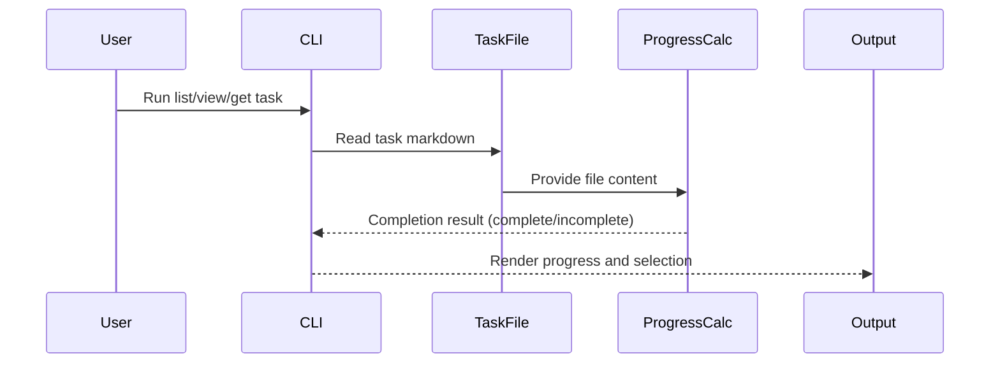

# 🔧 Implementation Template

Use this template for wiring components to business logic and integration work. Assumes components are created and business logic is tested.

**Title Format**: `🔧 Wire <feature> to business logic`

**Examples**:
- 🔧 Wire user profile to ProfileViewModel
- 🔧 Wire checkout flow to PaymentService

---

## 🔗 Dependencies
> Which tasks need to be completed first (if any)?

- [ ] None
- [ ] None

## 🎯 End Goal
> What is the tangible outcome of this integration?

Task progress and auto-completion treat each task file as a single task that is complete only when no unchecked markdown checkboxes remain anywhere in the file.

## 📍 Currently
> What is the current state?

- Task progress counts individual checkboxes across task files
- Checkboxes under Constraints and Acceptance Criteria are excluded from progress
- Auto-completion only checks Implementation Checklist items
- Change/task selection uses checkbox counts rather than file-level completion

## 🎯 Should
> What should the state be after implementation?

- Each task file counts as exactly one task
- Any unchecked checkbox anywhere in the file keeps the task incomplete
- Auto-completion triggers only when a task has zero unchecked checkboxes
- Progress and prioritization use file-level completion counts

## 🔌 Integration Points
> What needs to be connected?

### View ↔ ViewModel Connections

| View | ViewModel | Connection |
|------|-----------|------------|
| CLI commands | TaskProgress utilities | Progress calculation and auto-completion rules |

### Component ↔ State Connections

| Component | State Source | Data Flow |
|-----------|--------------|-----------|
| list/view/get task | Task file content | Scan checkboxes and compute completion |

## 📈 Data Flow
> How does data flow through the integrated system?

## ✅ Acceptance Criteria
> How do we verify the integration works?

- [ ] Progress counts one task per file
- [ ] Unchecked checkboxes in any section keep the task incomplete
- [ ] Auto-completion only occurs when no unchecked checkboxes remain
- [ ] Prioritization uses file-level completion percentages

## ⚠️ Constraints
> What limitations or constraints exist?

- [ ] Preserve existing frontmatter fields and status values
- [ ] Keep legacy tasks.md migration behavior intact

## 🧪 Integration Tests
> What integration tests verify the wiring?

- [ ] `Given a task file with an unchecked checkbox in Constraints When calculating progress Then the task is incomplete`

## 📝 Notes
> Additional context for integration

Update task progress utilities and CLI commands that consume progress calculations (list, view, get task).
