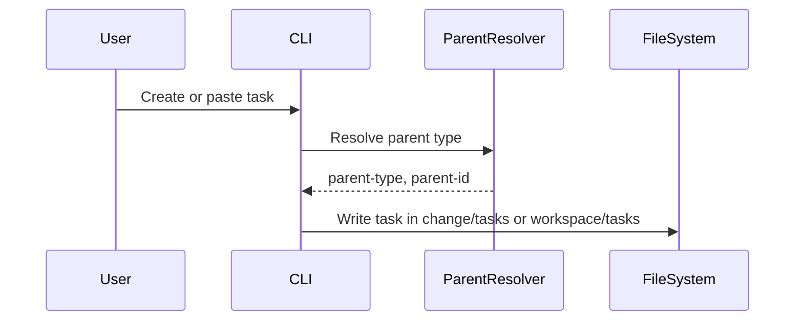

# 🔧 Implementation Template

Use this template for wiring components to business logic and integration work. Assumes components are created and business logic is tested.

**Title Format**: `🔧 Wire <feature> to business logic`

**Examples**:
- 🔧 Wire user profile to ProfileViewModel
- 🔧 Wire checkout flow to PaymentService

---

## 🔗 Dependencies
> Which tasks need to be completed first (if any)?

- [ ] 053-update-task-completion-storage-update-task-progress
- [ ] None

## 🎯 End Goal
> What is the tangible outcome of this integration?

Change-linked tasks are stored under `workspace/changes/<change-id>/tasks/` with `NNN-<task-name>.md` filenames, while `workspace/tasks/` is reserved for review and standalone tasks.

## 📍 Currently
> What is the current state?

- Change-linked tasks are stored in `workspace/tasks/` with parent-id in the filename
- Retrieval and transfer flows expect change tasks in centralized storage
- Migration flows move nested tasks into centralized storage

## 🎯 Should
> What should the state be after implementation?

- Change-linked tasks live in `workspace/changes/<change-id>/tasks/`
- Change task filenames omit the parent-id (`NNN-<task-name>.md`)
- Review and standalone tasks remain in `workspace/tasks/`
- Retrieval supports legacy change tasks still in centralized storage

## 🔌 Integration Points
> What needs to be connected?

### View ↔ ViewModel Connections

| View | ViewModel | Connection |
|------|-----------|------------|
| create/paste commands | Task storage routing | Parent-type drives file location |

### Component ↔ State Connections

| Component | State Source | Data Flow |
|-----------|--------------|-----------|
| transfer/migrate | Task file paths | Re-home tasks to canonical locations |

## 📈 Data Flow
> How does data flow through the integrated system?

## ✅ Acceptance Criteria
> How do we verify the integration works?

- [ ] Change tasks are created in `workspace/changes/<id>/tasks/`
- [ ] Review and standalone tasks remain in `workspace/tasks/`
- [ ] Transfer and migrate commands respect canonical locations
- [ ] Legacy change tasks in `workspace/tasks/` are still discoverable

## ⚠️ Constraints
> What limitations or constraints exist?

- [ ] Do not break review task storage in `workspace/tasks/`
- [ ] Preserve existing task frontmatter fields

## 🧪 Integration Tests
> What integration tests verify the wiring?

- [ ] `Given a change parent When creating a task Then the file is written to changes/<id>/tasks with NNN-<task-name>.md`

## 📝 Notes
> Additional context for integration

Update create/paste, item retrieval, migrate, transfer, and archive flows to use the new storage rules.
